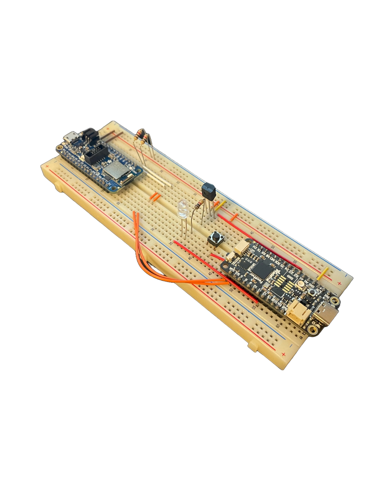
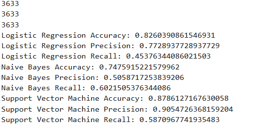

# Release Candidate

## Links:
[Repository](https://github.com/Emmett-Kogan/TVMaestro)  \
[Timesheet](https://docs.google.com/spreadsheets/d/1YhgjYHVoKcEeV9-Mo8SlOOsEO-r5k9PXPGEjSaAOhO4/edit#gid=0)  \
[Demo](https://youtu.be/cgaogLIKBzg?si=9I4l5czhxjKtClDw)

# TVMaestro
## Synopsis
TVMaestro serves to reduce the amount of time users spend watching ads, by replacing that time with time spent watching alternative programs. TVMaestro is composed of a remote module, mobile application, a machine learning module. The ML model takes the broadcast being played on the user's TV, and identifies when an advertisement is being played, at which point it sends a signal to the remote module, which changes the channel. To do this, the remote module will be configured by the user (via the mobile app), such that it has recorded the necessary control signals from the user's TV remote, and, so that it has a 'schedule', or priority list of channels. When it receives the signal from the ML module, the remote will then emulate the original remote by replaying the recorded signals so that the channel is changed from one that is watching an advertisement, to a different one (which could also be playing an ad, in which case there would be another channel change once that has been detected). The mobile app, more specifcally, provides an interface to program the remote by sending commands over bluetooth that specify, when to calibrate the remote, walk the user through a calibration sequence, the priority list of channels and various other adjustments that could be made using the remote (e.g. changing the volume or toggling the power).

## Project State
### Remote Module
So far, the remote module properly emulates signals from at least the test remote (a roku stick), as well as communicates over bluetooth to any phone, and processes all commands specified to configure the remote, load a schedule/priority list, and make other adjustments to the user's TV. This includes the design and implementation of various circuits for the signal reception and transmission, the I2C circuit between the NRF52840 board that deals with BLE communication and the RP2040 that does the rest of the functionality, the SPI circuit between the RP2040 and uSD card reader for persistent storage, and all code to drive these circuits, the state of the module, etc. Currently, most features specified for the remote module are fully working, and, the configuration data (button calibrations and schedules) are being preserved across power cycle by backing them up to the onboard flash, and loading the starting configuration from the flash and identifying it's validity before use.

The layout and connections of the various circuits are shown below. \

Here is also an updated bill of materials for the above circuit.
| Componenet              	| Count 	| Sourced from 	| Notes                                                                                           	|
|-------------------------	|-------	|--------------	|-------------------------------------------------------------------------------------------------	|
| TSOP4838                	| 1     	| [Mouser](https://www.mouser.com/ProductDetail/Vishay-Semiconductors/TSOP4838?qs=yGXpg7PJZCiwO12kec0Sug%3D%3D)       	|                                                                                                 	|
| SIR-56ST3F              	| 1     	| [Mouser](https://www.mouser.com/ProductDetail/ROHM-Semiconductor/SIR-56ST3F?qs=4kLU8WoGk0szrTFKqpunAQ%3D%3D)       	|                                                                                                 	|
| Adafruit Feather RP2040 	| 1     	| [Adafruit](https://www.adafruit.com/product/4884)     	| Any RP2040 will work, though the defines for each pin in the firmware will have to be modified and the Building/Running instructions assume this board. 	|
| Adafruit Feather NRF52840 |1      | [Adafruit](https://www.adafruit.com/product/4062) | The code related to this board was built using ArduinoIDE, so the libraries used specify this specefic board. |   	|
| 1 $\mathsf{k\Omega}$ Resistor     	| 3     	| [Any](https://www.amazon.com/1k-ohm-resistor/s?k=1k+ohm+resistor)          	|    |            
| Push button | 1    | [Any](https://www.amazon.com/Momentary-Tactile-Button-Switch-Through/dp/B0BK39MH7B) | This was simply used to simulate communication from the ML MCU and is unnecessary in the final build |

The following is a picture of the current state of the board. \

To better illustrate all of the commands implemented and their arguements, provided is a table of them and their descriptions from the remote module specification:
| Command | Arguements | Explanation |
|-------------------------	|-------	|--------------	|
| !record | button index | Overwrite the button signal |
| !play | button index | Transmit the signal of the button |
| !display | button index | Print internal representation of the button's signal |
| !identify | N/A | Prints a string to USB |
| !calibrate | N/A | Initiates a calibration sequence where the user must press 0-9, power, then volume up followed by volume down to record each of the buttons |
| !schedule | schedule | Configure the module's schedule, where the scheudle is a space seperated list of channel numbers |
| !vol | +/- | Adjust the volume by sending this command follwed by + or - to adjust up or down respectivley |

There are no known remaining issues with the remote module, however, more testing of the persistent state solution need to be performed, which will be significantly easier once the mobile application team is finished with the NRF52840 as performing end-to-end tests with it will be the best way to test the entire remote module. Further, testing the remote module with various setups, with different kinds of remotes, will also be beneficial to verify that it works outside of just the remotes available to me.

### ML Module
At this point, the ML model has been trained on ~14,500 sentences which is 16 hours of TV broadcast. The support vector machine's notable metrics was 90% on precision, 88% on accuracy, and 58% on recall. This is suitable for the purpose's of performing ad switching, but there will inevitably be moments where ad switches may occur where they shouldn't, and more probable is that ad-switching doesn't happen when it should happen. This is due to the low recall score of 58%. The ML model currently is separate from the other parts of the project, but mechanisms for raising an interrupts to the remote module have been laid out. The transcriptions from whisper will need to be communicated to our device and the Audio classification model will have to be loaded to the rp2040.

### Mobile Application
Currently, the mobile application serves as the UI for a user to interact with the other modules of the project. It currently is running natively on android devices through the use of development over USB with android studio. The app features two Fragments, the 'Home' and 'Schedule' pages which are accessable via the bottom navigation bar. The top bar displays the current fragment. These are focuesed on allowing the user to pair with their hardware and select scheduling options respectfully. The Home page allows a user to prompt a BLE scan and discover nearby devices, like the NRF52840. It allows users to select nearby devices, and if it is the hardware module, it allows the connection to occur. Once this connection is successful the user is notified. The Schedule page is where a user will edit the scheduling / ad detection options. It currently sports placeholder options for selecting a priority channel, and to enable or disable ad detection. Images of the two main pages are included below. 

## Progress 
!!Add to this for the rest of the progress made during the rc, although it doesn't need to be in seperate sections like the above section, it should still flow well and not be repetitive.

### Remote Module
During the work for the release candidate, features from the Beta were tested as per the Beta-spec, and potential bugs related to the emulation of TV signals have been addressed. Furhter we did some performance testing for the bluetooth connection, sending command packets to the remote module at various distances and obstruction conditions, and determined that the MTTF of the connection without any checksums/redundancy was acceptable, and that resending the packet in the event of a malfuntion was a suitable solution. Furhter, the rest of the handlers for commands to be received from the mobile app were finished, as well as adjustments to implementations of sending signals using the IR transmitter.

The main thing focused on during this sprint was to catch up the persistent state aspect of the project, as it had fallen behind due to difficulties elsewhere. Originally, the plan was to use a uSD card and implement a SPI driver to read/write to it, however, after wasting a week and a half pursueing that, I realized that the program memory on the RP2040 persists across power loss already. After which I looked into whether the RP2040 could write to it's own program memory, which, not only could it but there was already an easy to use API implemented in the pico-sdk already. So, after writing some helper functions to implement interfacing with the flash, and reorganizing the global data structures that would need to be preserved across a power cycle so that they could be easily copied to and loaded from the flash, this feature was pretty much done. However, the most notable thing with this solution is that flash wears out relativley quickly (10K - 100K write cycles), we need to be aware that during future testing we should probably avoid repeatedly loading/writing to the flash. Granted that for everyday use, where a calibration and schedule configuration may occur a few times a day, that would still place the lifetime of the remote in multiple years, so this would most likely not be the first point of failure.

### ML Module
### App
This sprint, work for the mobile application was dedicated to establishing a connection between the NRF52840 device and our mobile application. To achieve this, we utilized the BluetoothGattCallback, ConnectGatt, and PrintGattTable methods. The BluetoothGattCallback handled Bluetooth-related events like correct permissions and storing the Gatt related info, ConnectGatt initiated the connection process, and PrintGattTable aided in debugging and validation by visualizing the GATT table structure through logging. Essentially, once a user has selected to pair and the devices are shown after scanning, the connectGatt method is called with the selected bluetooth device as well as the predefined BluetoothGattCallback method. Once this method returns, the user is notified that the connection has occurred. Additionally, the PrintGattTable function was implemented to display the services and their characteristics provided by the NRF5240.
Additional work was also done on the UI portion of the connection screen. There was a bug causing a discrepancy between what bluetooth device was being selected by a user, and what the application thought the user was selecting. This was fixed by making the app verify that a bluetooth device is indeed a hardware unit before connecting. Modification of the notifications related to scanning and connecting was also done to be more clear to the user what was occurring. Some of the home screen text now updates based on the current state of pairing.

## Building and Running

### Remote Module
This assumes that the circuit has been constructed and the RP2040 has been connected to your computer.  Furhter, this also assumes the same for the NRF52840 and that the ArduinoIDE [setup](https://learn.adafruit.com/introducing-the-adafruit-nrf52840-feather/arduino-bsp-setup) guide has also been followed. \
To build the remote module, first clone the repository into a linux system (WSL works fine). You need to have cloned the pico-sdk somewhere else on your system as well. Export the path to the pico-sdk directory, e.g. `export PICO_SDK_PATH=~/pico/pico-sdk` so that cmake can generate the correct paths for dependencies. Change directories to the `TVMaestro/remote/build` directory or make it if it does not yet exist, then type `cmake ..` to generate the build scripts. Type `make` to build the project, note that this will generate a `remote.uf2` binary that we will now copy to the RP2040 board. You can set the feather to bootloader mode by holding reset and the 'BOOTSEL' button at the same time, and releasing the reset button first. A USB device should show up on your system and you can simply drag the .uf2 to the device. \
Furthermore, to build the BLE code and upload it to the NRF52840 feather, assuming the NRF52840 development guide with ArduinoIDE has been followed, you should simply be able to open the `controller` files in ArduinoIDE and compile/upload them to the board. I have found that this board has an error where sometimes when uploading to the board it will return some DFU error when updating the firmware. If this happens, simply put the board into the bootloader write mode by pressing the reset button twice quickly (if it is in bootloader mode, the neopixel LED will be green), update the COM port in the IDE to be the new NRF52840 port, and upload again.

### ML Module
### App
The below instructions assume a user has Android Studio downloaded as well as their android device connected to their computer over USB. It also assumes the user has enabled debugging/developing over USB in the developer options of their android device.
To build the mobile application and run it natively on an andorid device, clone the mobile application repository and open the folder as a project in android studio. In the device manager section of android studio select your device. Build the application using the "Run 'app'" button located in the top navigation bar. This will launch the app on the android device after the build has been complete.

## Usability
### Interface
In terms of the UI for the mobile application, a user can access available devices to pair to via BLE as well as the options for scheduling such as selecting channel schedules or enabling/disabling add detections, as well as options for controlling the hardware unit. The hardware options will be added in the near future. Below is some screenshots from an android device running the application with some of the relevant UI pages.

### Navigation
Current navigation through the mobile application is very intuitive. The two different activities (Home and Schedule) selectable on the bottom naviagtion bar allow users to quickly swap between setup and running options which are displayed to the user upon selection of the particular activity. This is depicted in the photo above. Navigating popup menus is also intuitive as each is accompanied with its own instructions, and users are returned to the previous activity after making a selection. These menus can be seen in the below section.

### Perception
Changes within the mobile applications UI are indicated visually with either a popup window or by displaying the currently selected option. A currently selected option is located adjacent to its respective selection menu for clarity sake. In the below photos of the mobile application it is clear that the UI changes as a user selects their different options.

### Responsiveness
Currently the application has immediate response time in terms of navigation and selection options. When a user begins scanning for devices there is a required wait time to scan for devices. During this wait time a popup is displayed, notifiying the user that a scan is in progress. This is currently set to 3 seconds to enable a thorough scanning of nearby devices for connection. Connecting to a hardware module sucessfully over bluetooth shows a notification that the connection was sucessful, in the case where it is not, it states so. Below is a screenshot from the mobile application showing some of the mentioned UI elements. In term's of the text classification model, transcription, sentence splitting, tokenizing, finding sentence embeddings, predicting the sentences, and then sending back predictions will all play into the amount of time that it takes for the model to send predictions.

## Build Quality
### Robustness
During regular use, a user will find it hard to crash the application as the available options are relatively limited and usage of the Activity and Fragment models allow for realtive reliability. This is prevented as the app uses variables that are set and checked in order to allow the user to do things in the UI. When we have to begin validating if our BLE connections are secure or not, we will use tools within the android bluetooth API that allow for checking of connection state, and other possible error scenarios. This has been tested so far via mimicing what regular user behavior. Specifically we want to utilize the BluetoothGattCallback and onConnectionStateChange methods as these provide a way to check a status parameter which relates to the connection quality. This has been tested so far via mimicing what regular user behavior.  

### Consistency
the number of sentences used in training and testing the ad detection text classification model increased from around 7000 sentences to 18000 sentences. Three different kinds of models were used: logistic regression, Naive Bayes, and support vector machine. The support vector machine performed very well on the test data which was about 20% of the total data. Its accuracy was ~88%, its precision was 90%, and its recall was 58%. The model was ran on an hour of college basketball and an hour of walking dead and performed quite well. That is, if 3/5 of each 5 sentence block is marked an ad that is a switch. Usually switches only occurred on advertisement segments, and they would occur pretty soon into the ad segment.

### Aesthetic Rigor
The remote can be tested through the Arduino IDE. Assets, in terms of text and images are accessible. In terms of the mobile application, a uniform aesthetic has been selected to keep the UI clear and concise (refer to the images in the Useability section). At the moment some of the popup's are not completely consistent with the total aesthetic (differing in color, size, or shape), and we plan to address this once development of other features has progressed more. For instance,  in the image below, the popup does not match the other colors associated with the app.

## Vertical Features
### External Interface
The remote module is now implemented using an NRF52840 to handle all bluetooth communication to a phone, which communicates with an RP2040 which handles any adc/signal processing and managing schedules. The BLE module was implemented using ArduinoIDE, and the pico module was implemented using the relevant sdk in C. It is functionally the same as the previous builds, but instead of communicating to a laptop over USB, the remote module advertises it's own bluetooth connection, and has a series of commands implemnted to configure and replay buttons, initiate a calibration sequence, and schedule configuration. The two MCUs communicate using I2C, as the NRF52840 doesn't actually have a secondary accessible UART, so the NRF52840 stores commands in a buffer and issues them to the pico. The pico also communicates with the ML module, for when to change channels, and this is implemented with a single GPIO input pin, that raises an interrupt once the level shifts from low to high. This was selected so that any ML solution that the other part of the project ended up implementing could communicate with the remote module, as the required resouces is literally one GPIO pin. For the sake of demo purposes, as the ML MCU was not available during the video recording process, I setup a button circuit to simulate creating rising edges to cause channel changes. More details about the progress made on these features, as well as specifics for the remote module itself were listed in the corresponding project state and project progress sections.

### Persistent State
While the progress on the persistent state relatefd components of this project were delayed due to issues attempting to port all functionality over to the NRF52840, an effort which is no longer being pursued, significant progress was made finishing this during this sprint. The original plan was to use an external SD card as persistent storage, and to write a SPI driver that could communicate with it, and preserve any and all relevant configuration data. Recently, I (Emmett) realized that this was a terrible idea since the RP2040 board we are already using has 8MB of onboard flash that is significantly easier to read/write to thanks to the pico sdk. So during this sprint, after wasting about a week and a half pursueing the SD card idea, that was abandoned and now schedule, calibration, and other configuration related data is just being written to a buffer in flash. This buffer is obviosly reset upon programming the device, however, whenever a schedule, or calibration command is issued to the device, the buffer in flash is updated as well so that a persistent copy of the current configuration can survive across power cycles. Additionally, during the setup/initialization code run on the RP2040, a set of global data structures holding all of the configuration information in RAM is initialized to whatever may be in flash, and the relevant valid flags and other metadata required to keep track of the flash's state are used to confirm whether we successfully recovered old configuration data, or if nothing was saved there (e.g. in the event the device is powercycled without being configured, it will behave as if it still were not conifgured). Not only does this reduce the complexity of the final code for the release candidate, but it reduces the cost per unit of the device as well as an external SD card reader, and SD card, and the overhead to serially communicate with it, as opposed to the internal QSPI connection which is much faster, are all gone.

Further, to address state related data to communications between the ML and remote modules brought up in previous documents: as a result of how the remote module communicates with the ML module, there is no information between the two required for the remote module to save, as the ML module simply raises a line.

### Internal Systems
Building off of the beta, the primary use case of the remote module, that is recording and replaying RF signals from TV remotes to emulate them, is finished. In order to accomplish this, when a record/calibrate command is issued to the device, it waits until a falling edge to be read from the ADC channel hooked up to an IR received, and records the following signal using a large signal buffer. As an arbitrary amount of these signals are to be supported, it's important that we store these long signals in an efficient way, so some compression solution was needed. In this case, we implemented somehting akin to run length encoding, where as the signal was a set of highs and lows of various lengths, we could simply store the value, and then a count of how long the ADC read that value consecutivley, and then use knowledge of how we are reading signals to reconstruct them later so that the timings of each are similair enough. This compresion scheme reduces the cost to store one remote signal by %1900. By default, the remote is configured to store 20 buttons, but it could suport more, granted outside of each digit, power, and the volume buttons, it isn't really necessary for a generic TV remote.

To specify how the remote is reproducing the signals, we originally planned to use a DAC to write voltage values at an RF transmitter, however, upon inspecting a set of TV remote's signals, we discovered that they were binary: either high or low, so instead we discarded the DAC and use a GPIO pin hooked up to the RF transmitter instead, to not only reduce the overall cost of the project, but also so that there is less latency between the processor figuring out that the signal value needs to change, and the signal actually changing. More specifically, instead of needing to transmit a new value over an I2C bus to the DAC, it can now just toggle a GPIO pin, which takes significantly fewer cycles (especially since the I2C bus is running at 100K baud). Again, now that the compressed signals are being played, the RP2040 simply changes the value being transmitted, sleeps a function on the duration of the signal in the buffer and approximatley how long it took to record each sample, and then repeats until the signal finishes.

The remote module also needs a method to communicate with the mobile app, and to accomplish this, we decided a bluetooth connection with a phone was a sufficient solution. While in the progress state section we provided a table including a list of commands, here we will instead expand upon the decision making progress and more details of the implmentation. The original plan, as illuded to earlier in this section, was to fully integrate all of the bluetooth communication functionality, with the rest of the remote's functionality on the same MCU. However, due to development issues with the Adafruit NRF52840 Sense board (like having to use ArduinoIDE, not being able to develop at a decent rate due to board programming errata, etc.), we decided instead to have the NRF52840 handle all bluetooth communication, and then talk to the RP2040 over an I2C bus (as the board also doesn't have an externally accessible UART other than the one speaking over USB to a laptop for debugging). Currently, the bluetooth is communicating with a phone running out app successfuly, and exchanging the command packets as specified in our documentation. The I2C communication between MCUs is also working, and the RP2040 is parseing/handling the packets properly too. Prior to handing off the NRF52840 board to the mobile app developer, sending packets from Adafruit's Bluefruit app was tested from a variety of distances, and the rate of malformed packets was negligible.

On the Android Studio side of things, the app communicates by utilizing a BLE scan method to first locate the remote module. This allows the mobile device to take in advertising bluetooth devices.  The connection is then established by using the BluetoothGattCallback and ConnectGatt methods which establish a server client relationship with the hardware module and the mobile app. By getting the Gatt information from the NRF52840, such as the services it provides and their characteristics, we can then engage in communication other than just pairing. This Gatt information is acquired via the PrintGattTable method, which provides us with the specific UUID’s needed to read/write to a specific service and its characteristics. This information is important to obtain if we want to send any data to the hardware.

// Either Matthew or Gary needs to update/expand this section for the release candidate
In terms of the gathering data for the model, an HDMI capture card was used to record live television broadcast off of a Roku using OBS. The videos were converted into audio files and then transcribed using OpenAI's Whisper. Then the transcriptions were separated into ads sentences and non-ads sentences through human labeling. We still need to work on all the mechanisms of having the model communicate with the MCU, and the remote.
