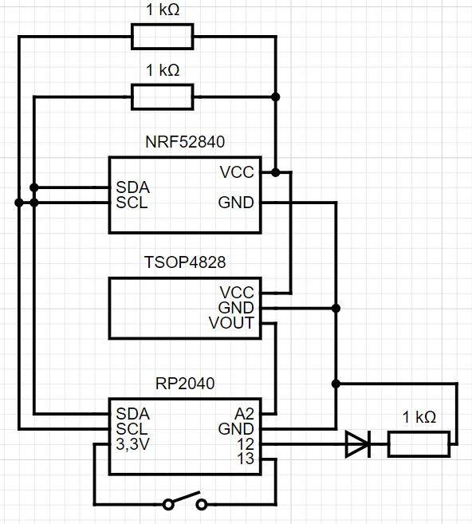
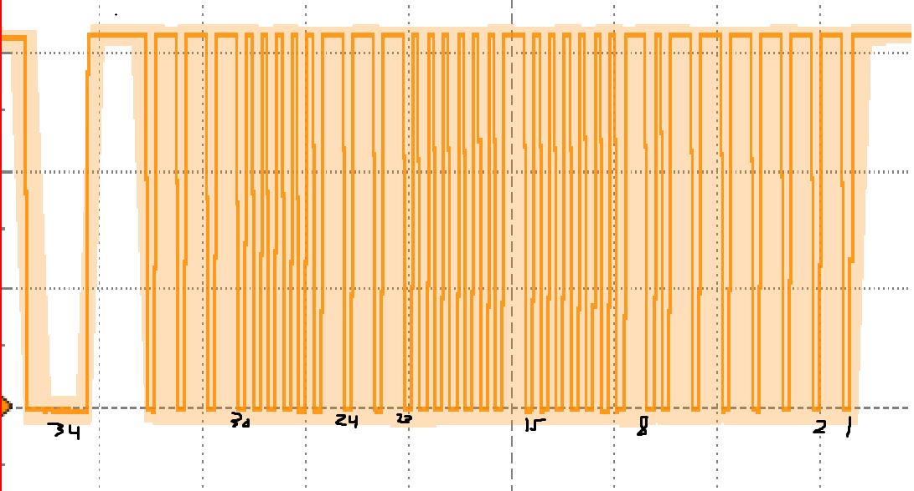
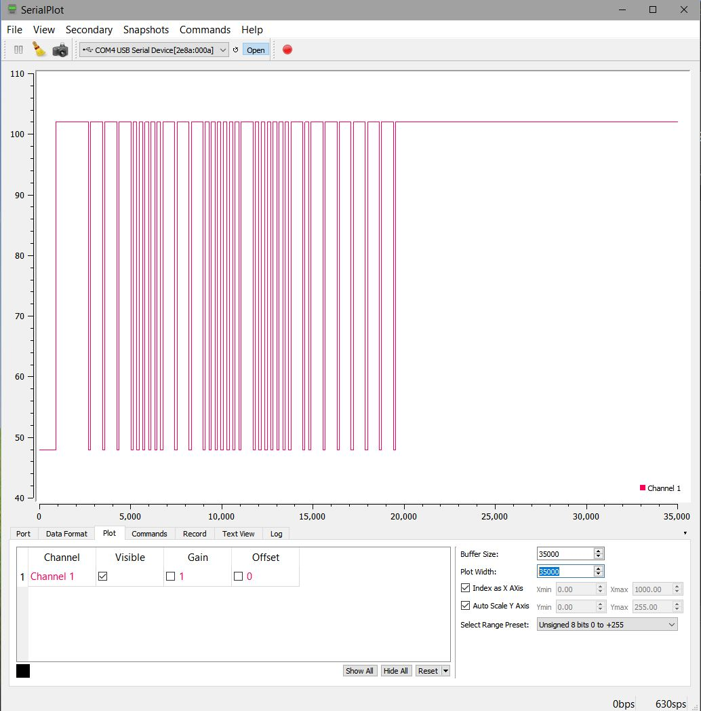
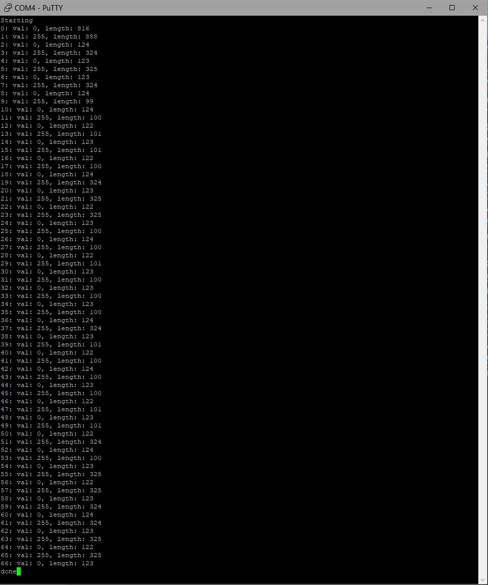
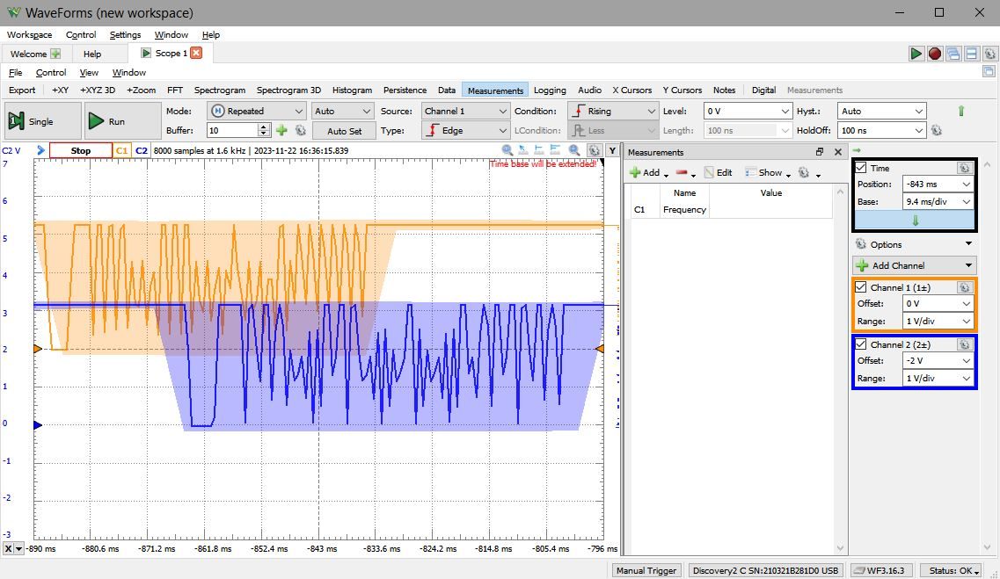

# Remote
The BLE portion is complete, where it advertises a bluetooth connection, and receives command strings over it. It forwards these command strings to the pico over I2C afterwards. This is the stage where a checksum, if necessary, will be implemented. Through testing so far, there haven't been issues with sending arbitrary amounts of data through this communication pipeline, however, I also haven't tested this for a variety of ranges/enough times to be able to say whether or not some form of error checking is necessary.

The pico application is also pretty much done now as far as recording signals, receiving communications with both the ML MCU and BLE board, and most functionality has been implemted, i.e. the commands for calibrating specific buttons, replaying certain buttons, some quality of life commands that were added, and setup for a calibration command that steps through with the app to record all necessary buttons, as well as schedule configuration has been implemented. The signals are done the same way as before, however, the DAC has been optimized out as the signals are just high or low, there is no need to be able to write a range of voltages to the emmitter, so the latency involved with the DAC is now gone.

## Bill of materials
| Componenet              	| Count 	| Sourced from 	| Notes                                                                                           	|
|-------------------------	|-------	|--------------	|-------------------------------------------------------------------------------------------------	|
| TSOP4838                	| 1     	| Mouser       	|                                                                                                 	|
| SIR-56ST3F              	| 1     	| Mouser       	|                                                                                                 	|
| Adafruit Feather RP2040 	| 1     	| Adafruit     	| Any RP2040 will work, though the defines for each pin in the firmware will have to be modified and the Building/Running instructions assume this board. 	|
| Adafruit Feather NRF52840 |1      | Adafruit | The code related to this board was built using ArduinoIDE, so the libraries used specify this specefic board. |   	|
| 1 $\mathsf{k\Omega}$ Resistor     	| 3     	| Any          	|    |            
| Push button | 1    | Any | This was simply used to simulate communication from the ML MCU and is unnecessary in the final build |

## Construction of the circuit
The layout and connections of the circuit are shown as follows, where only the necessary IO pins and connections are shown for this module: \

## Building/Running
This assumes that the circuit has been constructed and the RP2040 has been connected to your computer. \
To build the remote module, first clone the repository into a linux system (WSL works fine). You need to have cloned the pico-sdk somewhere else on your system as well. Export the path to the pico-sdk directory, e.g. `export PICO_SDK_PATH=~/pico/pico-sdk` so that cmake can generate the correct paths for dependencies. Change directories to the `TVMaestro/remote/build` directory or make it if it does not yet exist, then type `cmake ..` to generate the build scripts. Type `make` to build the project, note that this will generate a `remote.uf2` binary that we will now copy to the RP2040 board. You can set the feather to bootloader mode by holding reset and the 'BOOTSEL' button at the same time, and releasing the reset button first. A USB device should show up on your system and you can simply drag the .uf2 to the device. \
To use the app there are two commands, `record` and `play` that you can send over a serial connection followed by a number identifier to record and playback signals of certain buttons, for instance, doing `record 0`, pointing a remote at the board and pressing the power button, then following this with `play 0` will replay the signal that was just recorded (the power button) and if aimed the corresponding TV, will turn it on or off.

## Oscope screenshots of the module running
To prove that this actually works, below are a few screenshots of the signal from an oscilloscope, the signal being plotted in serial plot after being recorded, and the runs output of the signal:

### Signal as measured in waveforms

### Signal as measured by the RP2040

### Signal runs compressed in the MCU

### Comparison of regenerated and original signals

## Known issues
1. The ADC samples and toggling the GPIO pin are not synchronzied correctly when sending/receiving a signal. This causes a bit of variance that prevents the remote from working all of the time.
2. The current button setup for simulating signals from the ML MCU is not being debounced properly so there are times where repeated change channel events occur. Currently the interrupt is just being disabled for 100ms, but, I haven't had a chance to look at how long the button bounces for. This should not be an issue moving forward as a GPIO pin sending the signal from the ML MCU should not bounce as severly (or at all). 
